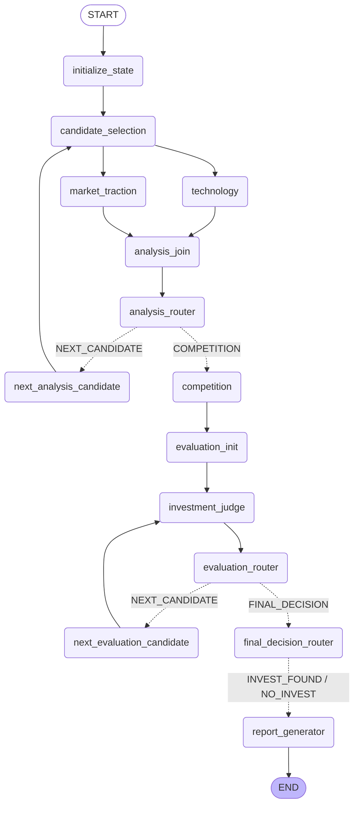

# AI Startup Investment Evaluation Agent
본 프로젝트는 General-purpose Humanoid Robotics 스타트업(Figure AI, Apptronik, 1X Technologies)에 대한 투자 가능성을 자동으로 평가하는 에이전트를 설계하고 구현한 실습 프로젝트입니다.


## Overview
- Objective : 휴머노이드 스타트업의 기술·제품 성숙도, 시장·고객 Traction, 경쟁 차별성, 제조·배치 확장성 등을 기준으로 투자 적합성 분석
- Method : LangGraph Multi-Agent, Agentic RAG (하위 질문 검색 → 근거 충분성 점검 → 부족 질문만 재검색 → 근거 대조), Bessemer Checklist 기반 12문항 평가
- Tools : Chroma 벡터DB 검색, 한국어 질의 자동 번역, Python 규칙 기반 점수 검증·투자 판정


## Features
- PDF 자료 기반 정보 추출: 기업 자료 15개 + 공통 시장 보고서 7개 (113쪽), 페이지·청크 단위 출처 추적
- Agent별 검색 범위 제한: 현재 평가 기업의 자료만 검색하고, 시장 근거와 기업 근거를 섞지 않음
- 근거 안전 규칙: 기업 주장 ≠ 달성 성과, Demo ≠ 상용 배치, 근거 없음 ≠ 부정 근거
- Evidence Level(E0~E5)과 1·3·5점 척도로 12개 문항 평가, 근거가 없는 문항은 N/A
- LLM이 아닌 Python 규칙으로 최종 점수·판정 계산 (INVEST / HOLD / HOLD_INSUFFICIENT_EVIDENCE)
- 모든 후보를 끝까지 평가한 뒤, 추천 기업이 없어도 이유를 담은 투자 보고서와 REFERENCE 생성
- LangSmith 트레이싱으로 전체 실행 기록


## Tech Stack
| Category | Details |
|---|---|
| Framework | LangGraph, LangChain, Python 3.11 |
| LLM/Generator | gpt-4o-mini (OpenAI API, temperature 0) |
| LLM/Judge | gpt-4o-mini (구조화 출력 + Python 검증) |
| Retrieval | Chroma - Hit Rate@5 0.906, MRR@5 0.667 (문서 기반 질문 64개, Agent별 검색 범위 적용, 한국어 질의 자동 번역) |
| Embedding | intfloat/multilingual-e5-base (gte-multilingual-base와 비교 후 선정) |
| Tracing | LangSmith |


## Agents
- Technology & Product Agent: 현재 기업의 기술자료를 검색해 제품·AI·자율성·신뢰성·안전 등 기술 성숙도를 분석
- Market & Traction Agent: 공통 시장 보고서와 기업 자료를 나눠 검색해 시장 규모, 고객 배치·계약, 사업모델, 팀, 제조·Fleet 운영을 분석
- Competition Agent: 모든 후보의 분석 결과를 비교해 Target Market 맥락, 차별성, 상대 Risk를 정리 (신규 검색 없음)
- Investment Judge Agent: 분석 근거로 12개 문항을 채점하고, Python 규칙으로 최종 점수와 투자 판정을 확정
- Report Generator Agent: 확정된 결과만으로 SUMMARY, 기업별 분석, 점수표, REFERENCE를 담은 투자 보고서 생성

### 평가 기준 (Q1~Q12)
| 구분 | 문항 |
|---|---|
| Bessemer Checklist | Q1 Market Size · Q2 Problem/Product Fit · Q3 Willingness to Pay · Q4 Differentiation · Q5 Team · Q6 Early Customer Response · Q7 Business Model · Q8 Upside Potential · Q9 Risk · Q10 Founder Commitment |
| 휴머노이드 특화 | Q11 Technology Maturity · Q12 Manufacturing & Deployment |

- 점수: 1·3·5점 (5점은 외부 검증 근거 E3 이상 필요), 판단 불가 시 N/A
- 판정: 평가 가능 문항 9개 미만 → HOLD_INSUFFICIENT_EVIDENCE / 평균 3.5 이상 → INVEST / 미만 → HOLD


## Architecture


- 기업별 분석 Loop: 한 기업 안에서 Technology와 Market & Traction을 병렬 실행한 뒤 합류
- 전체 후보 분석 후 Competition 1회 → Investment Judge가 후보를 순차 평가
- 첫 INVEST가 나와도 멈추지 않고 모든 후보를 평가한 뒤 보고서 생성


## Directory Structure
```
├── data/                  # 문서 풀 (manifest.csv, 기업 자료, 시장 보고서, company_profiles.json)
├── agents/                # Agent 모듈 (Technology, Market & Traction, Competition, Judge, Report)
├── prompts/               # 프롬프트 템플릿 (common.py: 전체 공통 근거·인용 규칙)
├── evaluation/            # 12문항 평가 기준, 점수 검증, 투자 판정 규칙
├── rag/                   # 인덱싱, 검색, 임베딩, 검색 성능 평가
├── documents/             # PDF 로딩·정리, 메타데이터, 문서 구성 점검
├── core/                  # LangGraph 그래프, State, LLM, 트레이싱 설정
├── tests/                 # 단위 테스트
├── outputs/               # 평가 결과 저장
├── app.py                 # 실행 스크립트
└── README.md
```


## Usage
```bash
uv sync                              # 패키지 설치
cp .env.example .env                 # .env에 OPENAI_API_KEY 입력
uv run python -m rag.build_index     # 벡터DB 생성 (최초 1회 또는 문서 변경 시)
uv run python app.py                 # 전체 실행 → outputs/report_*.md
```

- 일부 기업만 평가: `uv run python app.py --companies "Apptronik"`
- 검색 성능 재측정: `uv run python -m rag.evaluate run`
- 단위 테스트: `uv run python -m unittest discover -s tests`


## Contributors
- 김규빈 : Market & Traction Agent, RAG 파이프라인(인덱싱·검색·임베딩 선정·성능 평가), LangGraph 그래프·State 설계
- 박진근 : Technology & Product Agent
- 윤서진 : Competition Agent, Report Generator
- 정지우 : Investment Judge Agent, 평가 기준 검증
- 강지훈 : RAG 문서 생성 및 기업 조사, 검증
